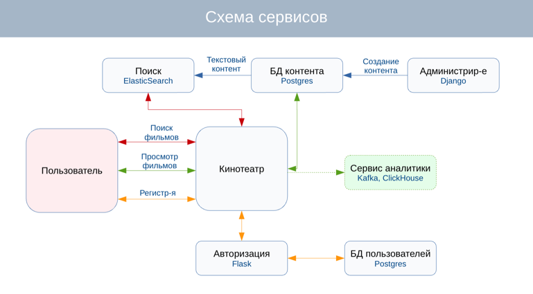

# UGC

### Изменения

    Добавлен ELK.
    
    Добавлен CI-процесс.

#### services/etl

    Добавлен загрузчик данных в MongoDB.

    Добавлены схемы новых данных.

#### services/oltp

    Добавлены эндпойнты для получения новых данных (likes, bookmarks, reviews, reviews/likes)

#### services/olap
    Расширен функционал класса, отвечающего за взаимодействие с ClickHouse (больше вариантов аналитических запросов).

    Добавлен MongoDB для хранения данных, которые должны быстро отдаваться пользователю (напр.,список фильмов с его лайками).

### Первый запуск
``` 
1. make launch_ch (Запуск контейнеров ClickHouse)
2. make storages_ch (Создание БД и таблиц в ClickHouse)
3. make mongo (Запуск контейнеров Mongo)
4. make mongo_set (Конфигурирование Mongo)
5. make mongo_db (Создание шардированных таблиц Mongo)
6. make launch_etl (Запуск всех сервисов)
``` 

### Запуск сервисов при существующих БД и таблицах
``` 
make launch_etl
``` 

### Выбор OLTP хранилища

#### Запись данных


#### Чтение данных


#### Запись/Чтение данных


### Выбор OLAP хранилища

#### Диаграмма результатов


``` 
Строк для записи – 5 000 000
Запросов на чтение – 5 000
Размер партии – 500
Результат – время в секундах
``` 

### ClickHouse vs Mongo

#### Диаграмма результатов


``` 
Строк для записи – 1 000 000
Запросов на чтение – 300
Размер партии – 5 000
Результат – время в секундах
``` 
